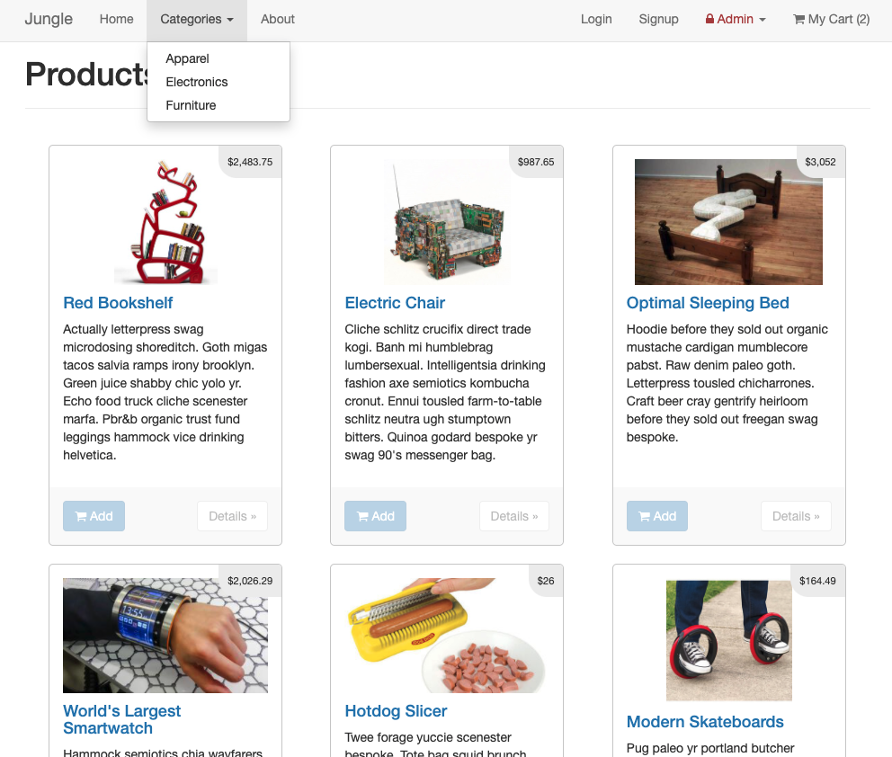
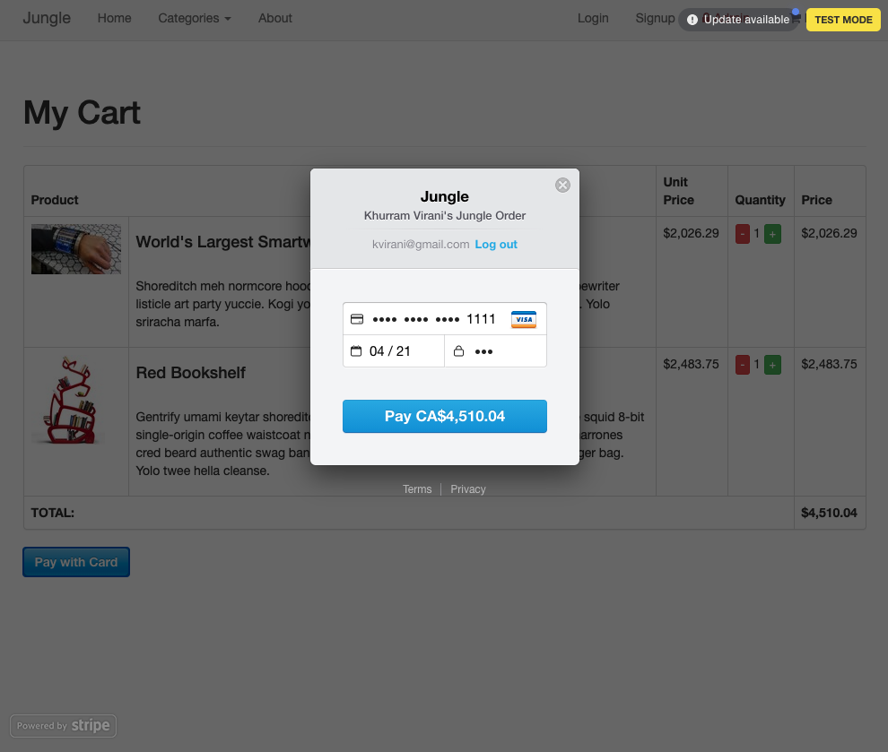
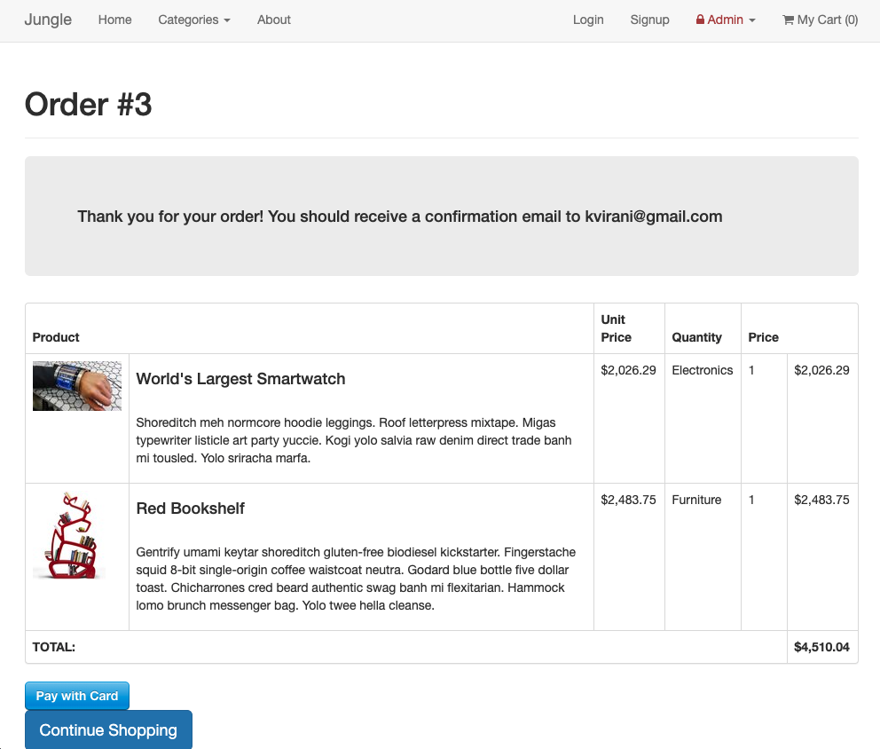
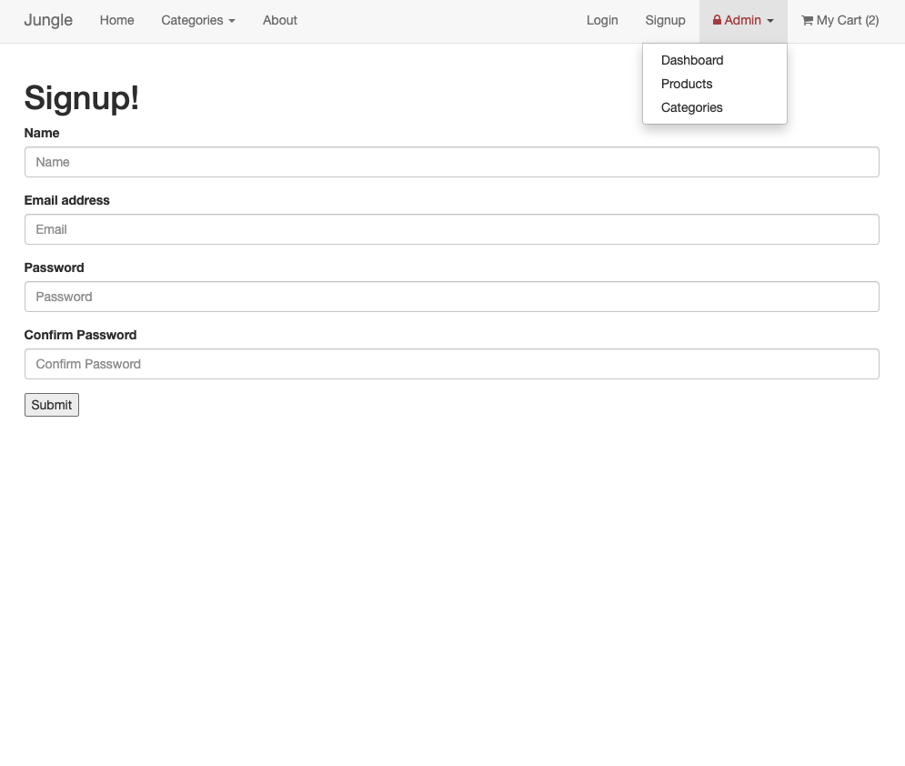

# Jungle

*This project has been delievered in the 10th week of Lighthouse Labs' Web Development Bootcamp. More than just about learning a new language, ecosystem and framework, it is moreso a simulation of the real world, as I've inherited an existing code base in a language / framework that I was not familiar with.*

## Description

A mini e-commerce application built with Rails 4.2 for purposes of learning Rails through examples.

## Final Product

|  |  |
| ------------- |:-------------:|
|  |  |

## Dependencies

* Rails 4.2 [Rails Guide](http://guides.rubyonrails.org/v4.2/)
* PostgreSQL 9.x
* Stripe

## Tests
* Capybara
* Poltergeist
  * Phantomjs (npm)
* Database_cleaner

## Getting Started

1. Run `bundle install` to install dependencies
2. Create `config/database.yml` by copying `config/database.example.yml`
3. Create `config/secrets.yml` by copying `config/secrets.example.yml`
4. Run `bin/rake db:reset` to create, load and seed db
5. Create .env file based on .env.example
6. Sign up for a Stripe account
7. Put Stripe (test) keys into appropriate .env vars
8. Run `bin/rails s -b 0.0.0.0` to start the server

## Stripe Testing

Use Credit Card # 4111 1111 1111 1111 for testing success scenarios.

More information in their docs: <https://stripe.com/docs/testing#cards>